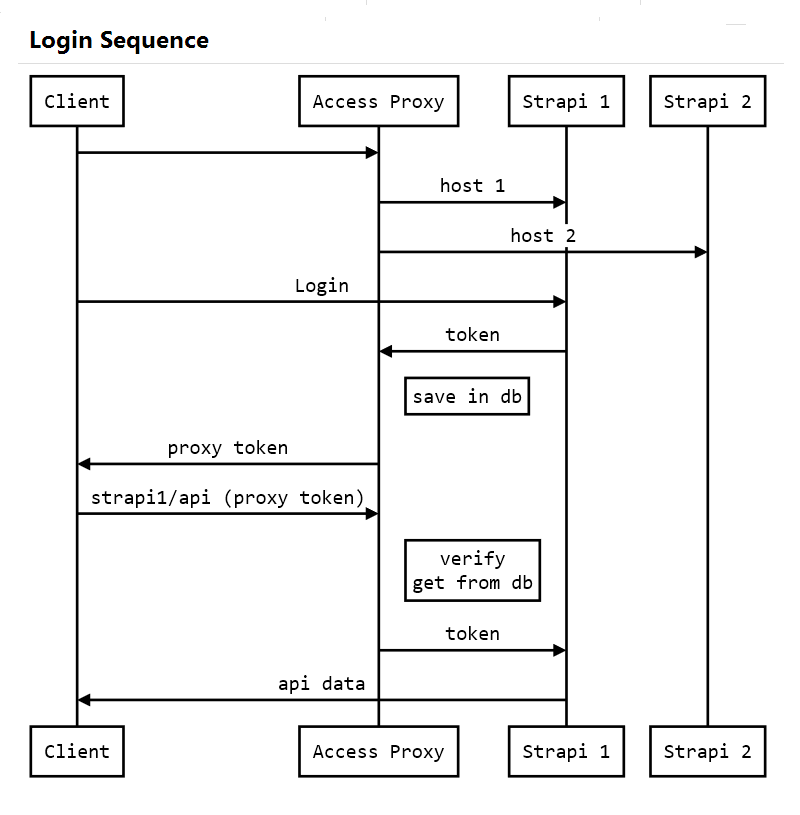

# Strapi Access Proxy

Strapi access management based on JWT.

### Motivation

Strapi does not offer access management nor does it have to offer because the needs can be very different from case to case.
Moreover, we can have multiple Strapi applications installed which would mean that each application manages its access separately. This project aims to centrally manage access to multiple Strapi installations. Also, the way this project is structured leaves room for adaptation to other types of applications.

### Requirements

    * node: >=10.0.0
    * npm: >=6.0.0
    * mongoDB >=2.6
    * downstream server Nginx, Apache, or whatever, to proxy connections for protected routes to this host (default `localhost:7331` for production, `localhost:3002` for development)

### Installation

For now, the application can be installed only by cloning this project.
Out of the box, this application proxies incoming connections to `localhost:1337` which is Strapi's default host.
Extending the number of proxied hosts can be done by editing some modules:

-   config/env/\*
-   config/jwt/hosts

First, clone the project:

```
cd /path/to/desired/location
git clone https://github.com/SorinGFS/strapi-access-proxy.git
cd strapi-access-proxy
npm install
```

Then, configure the downstream server to proxy the requests to this app: `localhost:7331` (default for production) or `localhost:3002` (default for development)

Edit `JWT_SECRET`, `COOKIE_SECRET` or other vars in `config/env/*` files.
Edit mongoDB connection parameters which forms the `MONGO_URI`, default is: `mongodb://localhost:27017/access` with no authentication (blank `DB_USER and DB_PASS`)

Lastly, start the app with:

```
 `npm run start` or `npm run dev`.
```

### Features

-   Separate configurations for development and production environment
-   CSRF Protection
-   Rate Limit
-   Slow Down (DDOS protection)
-   Fingerprint
-   JWT based Access Management:
    -   support for multiple hostnames
    -   support for single or multiple login devices (default multiple devices)
    -   support for sliding token expiration (default)
    -   support for refresh token (needs specific configuration)
    -   support for RSA signed JWT
-  Logout route (Strapi doesn't have)

### How it works

By default on login Strapi responds with a json web token in the response body. This app is filtering the token and save it in the database, and replaces that token with own token based on the payload of the Strapi token. From this point on this app takes the access management responsability. The Strapi token is valid one month. This app can manage the token validation separately for each host. For example, if the host is configured to expire the token in 30 minutes `(default)` if in this interval the user use the token validity is extended to the next 30 minutes (this is sliding expiration used by default). If the token expires user has to re-login into Strapi app. If is desired to let token to be valid the entire browser session the frontend framework must use the token to access this app within it's validity interval.



### Customization

#### Terminology used:

`csrs = cross site request signature (or secret)` -set by default in secure session cookie

`csrt = cross site request token` -set by default in secure session cookie

#### Add hosts

edit `config/jwt/hosts.json`

```json
[
    {
        "hostname": "my.example.com",
        "secretKey": "if-secretKey-is-provided-RSA-keys-wont-be-used",
        "privateKeyPath": "",
        "publicKeyPath": "",
        "options": {
            "proxiedHost": "localhost:1337",
            "maxInactivitySeconds": 300,
            "bindCsrs": { "csrtInHeader": false },
            "accessLog": "custom",
            "allowOrigins": [],
            "signOptions": { "audience": "my.example.com", "noTimestamp": false },
            "refreshOptions": { "verify": { "audience": "my.example.com" }, "noTimestamp": false }
        }
    },
    {
        "hostname": "localhost",
        "secretKey": "if-secretKey-is-provided-RSA-keys-wont-be-used",
        "privateKeyPath": "/etc/letsencrypt/live/domain.com/privkey.pem",
        "publicKeyPath": "C:\\Users\\username\\windows-key-path-example\\fullchain.pem",
        "options": {
            "proxiedHost": "localhost:1337",
            "maxInactivitySeconds": 1800,
            "bindCsrs": { "csrtInHeader": false },
            "accessLog": "access-log-template-name",
            "allowOrigins": [],
            "signOptions": { "audience": "localhost", "noTimestamp": false },
            "refreshOptions": { "verify": { "audience": "localhost" }, "noTimestamp": false }
        }
    },
    {
        "hostname": "my.restaurant.com",
        "secretKey": "",
        "privateKeyPath": "/etc/letsencrypt/live/my.restaurant.com/privkey.pem",
        "publicKeyPath": "/etc/letsencrypt/live/my.restaurant.com/fullchain.pem",
        "options": {
            "proxiedHost": "localhost:1338",
            "maxInactivitySeconds": 3600,
            "bindCsrs": { "csrtInHeader": false },
            "accessLog": "custom",
            "allowOrigins": [],
            "signOptions": { "audience": "my.restaurant.com", "noTimestamp": false },
            "refreshOptions": { "verify": { "audience": "my.restaurant.com" }, "noTimestamp": false }
        }
    }
]
```

-   Notice the last host's proxied host is a different Strapi app! You can configure multiple hosts for the same proxied host, and you can configure multiple proxied hosts. Each entry in `hosts` corresponds to a jwtHost, which is used to configure the response token.

#### Token configuration

-   See examples in `examples/jwt-usage-*`

#### Fingerprint configuration

Fingerprint can use GeoIP, but since requires `MaxMind` account is disabled by default. To enable it run this in terminal:

```
cd node_modules/geoip-lite && npm run-script updatedb license_key=YOUR_LICENSE_KEY
```

You may also want to disable some other options when GeoIP is used.

### List of configurable modules (middlewares)

-   Fingerprint
-   Access Control
-   Rate Limit
-   Slow Donw

### Some usage ideas

#### Basic usage (my current case)

-   use Strapi as authentication provider and as a keeper for secure user data
-   add a new `TEXT` field in Strapi User Content Type named `audience` to hold the domain names that user has access to
-   use this app to manage the access to that Strapi db

#### Separate the admin channel from the regular user channel

-   You may block admin routes in downstream server and stil have centralized access on localhost or local network thru this proxy.

#### Multiple Strapi apps, and another Strapi app for central user management

-   configure the fist basic scenario
-   configure your other Strai apps with public data only. This way those apps can perform faster, can be placed on other server, can use load balancer, and so on. Take advantage from the fact that less than 10% of requests goes to secure user data.

#### External api connections

-   Use this proxy to perform external api requests in the backend instead of frontend, it increases the security.

#### Feel free to submit new ideas. Sky is the limit!

### Todo next:

-   Convert the application to installable npm module.
-   SSL support to access Strapi apps located on the web.
-   Finalize `access-log and access-control` modules.

### Disclaimer

Please do not ask for support, since I'm a lone wolf I don't have time for this. I will try to improve the project within the time available.

### License

[MIT](LICENSE)
